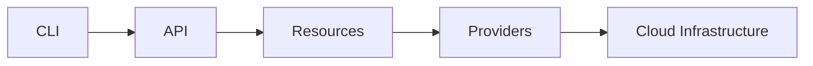

pragma-os manages infrastructure through three core concepts: resources, providers, and reactive dependencies.



## Core Concepts

<CardGroup cols={3}>
  <Card title="Resources" icon="cube">
    Infrastructure components—storage buckets, datasets, APIs—that you declare and pragma-os provisions.
  </Card>
  <Card title="Providers" icon="plug">
    Components that manage specific resource types, handling creation, updates, and deletion.
  </Card>
  <Card title="Reactive Dependencies" icon="arrows-rotate">
    When one resource changes, dependent resources automatically update.
  </Card>
</CardGroup>

---

## Resources

A resource is an infrastructure component—a storage bucket, a BigQuery dataset, a service account. You declare resources in YAML:

```yaml
provider: gcp
resource: bigquery-dataset
name: analytics
config:
  location: EU
```

pragma-os creates the dataset, tracks its state, and manages its lifecycle.

---

## Providers

Providers manage specific resource types.

<Tabs>
  <Tab title="GCP Provider">
    Manages Google Cloud Platform resources:
    - Storage buckets with proper IAM
    - BigQuery datasets and tables
    - Service accounts and permissions
  </Tab>
  <Tab title="Pragma Provider">
    Manages platform-level resources:
    - Secrets and credentials
    - Configuration values
  </Tab>
</Tabs>

You never interact with providers directly. You declare resources, and pragma-os routes them to the right provider automatically.

---

## Reactive Dependencies

Infrastructure components depend on each other—a data pipeline needs a storage bucket, which needs a service account. pragma-os tracks these dependencies and propagates changes automatically.

```yaml
provider: gcp
resource: bigquery-dataset
name: analytics
depends_on:
  - gcp/storage/data-lake
```

<Steps>
  <Step title="You update a resource">
    The `data-lake` bucket configuration changes.
  </Step>
  <Step title="pragma-os detects the change">
    The dependency graph identifies affected resources.
  </Step>
  <Step title="Dependents automatically update">
    The `analytics` dataset re-evaluates and adapts.
  </Step>
</Steps>

Changes propagate through your infrastructure dependency graph automatically.

---

## Learn More

<CardGroup cols={3}>
  <Card title="Resources" icon="cube" href="/concepts/resources">
    Learn how to declare and configure infrastructure components.
  </Card>
  <Card title="Providers" icon="plug" href="/concepts/providers">
    Understand how providers manage resources.
  </Card>
  <Card title="Reactive Dependencies" icon="diagram-project" href="/concepts/reactive-dependencies">
    See how changes propagate through your infrastructure.
  </Card>
</CardGroup>

For an introduction to what pragma-os offers, see [Learn More](/learn).
