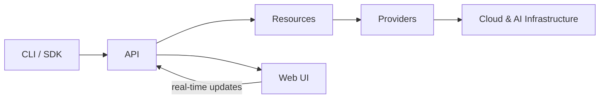

pragma-os manages infrastructure through three core concepts: resources, providers, and reactive dependencies.


```mermaid
graph LR
    A[CLI / SDK] --> B[API]
    B --> C[Resources]
    C --> D[Providers]
    D --> E[Cloud & AI Infrastructure]
    B --> F[Web UI]
    F --> |real-time updates| B
```

## Core Concepts

<CardGroup cols={3}>
  <Card title="Resources" icon="cube">
    Infrastructure components — AI models, agents, storage buckets, secrets — that you declare and pragma-os provisions.
  </Card>
  <Card title="Providers" icon="plug">
    Components that manage specific resource types, handling creation, updates, and deletion.
  </Card>
  <Card title="Reactive Dependencies" icon="arrows-rotate">
    When one resource changes, dependent resources automatically update through the dependency graph.
  </Card>
</CardGroup>

---

## Resources

A resource is an infrastructure component — an AI agent, a language model, a secret, a storage bucket. You declare resources in YAML:

```yaml
provider: agno
resource: agent
name: assistant
config:
  model:
    provider: agno
    resource: anthropic-model
    name: claude
  instructions: "You are a helpful assistant."
```

pragma-os creates the agent, tracks its state, and manages its lifecycle. Resources can reference each other's outputs through field references and dependency declarations.

---

## Providers

Providers manage specific resource types. pragma-os includes providers for AI infrastructure, cloud platforms, and container orchestration.

<Tabs>
  <Tab title="Agno Provider">
    Manages AI agent infrastructure:
    - Language models (Anthropic, OpenAI)
    - Agents with tools and instructions
    - Multi-agent teams
    - Knowledge bases and vector storage
    - Persistent memory and storage
  </Tab>
  <Tab title="GCP Provider">
    Manages Google Cloud Platform resources:
    - Storage buckets with IAM
    - CloudSQL database instances
    - Secrets and credentials
  </Tab>
  <Tab title="Kubernetes Provider">
    Manages Kubernetes workloads:
    - Deployments with scaling configuration
  </Tab>
  <Tab title="Pragma Provider">
    Manages platform-level resources:
    - Secrets and credentials
    - File uploads and storage
  </Tab>
</Tabs>

You never interact with providers directly. You declare resources, and pragma-os routes them to the right provider automatically.

---

## Reactive Dependencies

Infrastructure components depend on each other — an AI agent needs a language model, which needs an API key secret. pragma-os tracks these dependencies and propagates changes automatically.

```yaml
provider: agno
resource: agent
name: assistant
config:
  model:
    provider: agno
    resource: anthropic-model
    name: claude
```

<Steps>
  <Step title="You update a resource">
    The `claude` model's configuration changes.
  </Step>
  <Step title="pragma-os detects the change">
    The dependency graph identifies that `assistant` depends on `claude`.
  </Step>
  <Step title="Dependents automatically update">
    The `assistant` agent receives the updated model and rebuilds.
  </Step>
</Steps>

Changes propagate through your infrastructure dependency graph automatically. You can apply resources in any order — pragma-os resolves dependencies and processes resources when their requirements are met.

---

## Real-Time Visibility

The web UI provides a live graph view of your resources and their dependencies. Resource state changes stream in real-time, so you can watch your infrastructure converge as resources move through their lifecycle states.

---

## Learn More

<CardGroup cols={3}>
  <Card title="Resources" icon="cube" href="/concepts/resources">
    Learn how to declare and configure infrastructure components.
  </Card>
  <Card title="Providers" icon="plug" href="/concepts/providers">
    Understand how providers manage resources.
  </Card>
  <Card title="Reactive Dependencies" icon="diagram-project" href="/concepts/reactive-dependencies">
    See how changes propagate through your infrastructure.
  </Card>
</CardGroup>

For an introduction to what pragma-os offers, see [Learn More](/learn).
