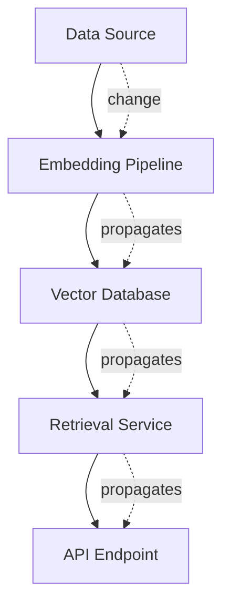

Reactive dependencies enable automatic change propagation through your infrastructure. When a resource changes, pragma-os identifies all dependent resources and updates them automatically.



Here's how you declare this dependency chain:

```yaml
# Data source - the foundation
provider: gcp
resource: bigquery-dataset
name: documents
config:
  location: EU
---
# Embedding pipeline depends on the data source
provider: gcp
resource: bigquery-dataset
name: embeddings
depends_on:
  - gcp/bigquery-dataset/documents
config:
  source: "${gcp/bigquery-dataset/documents.outputs.dataset_id}"
---
# Vector index depends on embeddings
provider: gcp
resource: bigquery-dataset
name: vector-index
depends_on:
  - gcp/bigquery-dataset/embeddings
config:
  source: "${gcp/bigquery-dataset/embeddings.outputs.dataset_id}"
```

When `documents` changes, pragma-os:

1. Detects the change
2. Identifies all dependent resources
3. Propagates updates through the graph
4. Ensures everything stays in sync

## Declaring Dependencies

Use `depends_on` to establish relationships:

```yaml
provider: gcp
resource: bigquery-dataset
name: analytics
depends_on:
  - gcp/storage/data-lake
config:
  location: EU
```

The format is `provider/resource/name`, matching how resources are identified in pragma-os.

## Referencing Dependency Outputs

Access values from dependencies using field references:

```yaml
provider: gcp
resource: bigquery-dataset
name: analytics
depends_on:
  - gcp/storage/data-lake
config:
  source_bucket: "${gcp/storage/data-lake.outputs.bucket_url}"
  source_path: "${gcp/storage/data-lake.outputs.name}/data"
```

When `data-lake` updates, `analytics` receives the new output values automatically.

## Dependency Rules

**Dependencies must exist and be ready.** pragma-os won't process a resource until all dependencies are in READY state.

**Circular dependencies are not allowed.** If A depends on B, B cannot depend on A—this prevents infinite update loops.

**Changes cascade downward.** When a resource updates, all resources that depend on it are notified and can react to the change.

## Next Steps

<CardGroup cols={2}>
  <Card title="Resources" icon="cube" href="/concepts/resources">
    Understand resource lifecycle and states.
  </Card>
  <Card title="Providers" icon="plug" href="/concepts/providers">
    Learn how providers manage resources.
  </Card>
</CardGroup>
