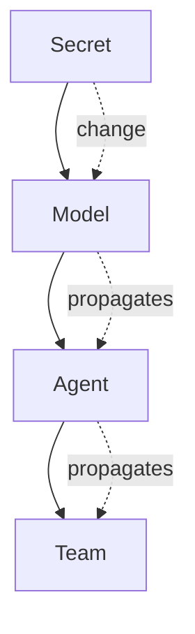

Reactive dependencies enable automatic change propagation through your infrastructure. When a resource changes, pragma-os identifies all dependent resources and updates them automatically.


```mermaid
graph TD
    A[Secret] --> B[Model]
    B --> C[Agent]
    C --> D[Team]

    A -. "change" .-> B
    B -. "propagates" .-> C
    C -. "propagates" .-> D
```

## Field References

Use field references to connect a resource's config field to another resource's output. When the referenced resource updates, the dependent resource automatically receives the new value.

```yaml
# Secret holds the API key
provider: pragma
resource: secret
name: anthropic-key
config:
  data:
    api_key: "sk-ant-..."
---
# Model references the secret's output
provider: agno
resource: anthropic-model
name: claude
config:
  model_id: claude-sonnet-4-5-20250929
  api_key:
    provider: pragma
    resource: secret
    name: anthropic-key
    field: outputs.api_key
```

The `api_key` field is a **FieldReference** — a structured pointer to another resource's output. The format is:

| Key | Description | Example |
|-----|-------------|---------|
| `provider` | Provider of the referenced resource | `pragma` |
| `resource` | Resource type | `secret` |
| `name` | Resource name | `anthropic-key` |
| `field` | Output field path (must start with `outputs.`) | `outputs.api_key` |

When `anthropic-key` updates, pragma-os re-resolves the field reference and sends the new value to the `claude` model's provider.

## Dependency[T] Pattern

For provider authors, `Dependency[T]` declares a whole-resource dependency. Instead of referencing a single output field, the provider receives the entire resolved resource — its config, outputs, and metadata.

```yaml
# Agent depends on a model resource
provider: agno
resource: agent
name: my-agent
config:
  model:
    provider: agno
    resource: anthropic-model
    name: claude
  instructions: "You are a helpful assistant."
```

In the provider code, this is declared as:

```python
from pragma_sdk import Config, Dependency

class AgentConfig(Config):
    model: Dependency[AnthropicModel]
    instructions: str
```

When the `claude` model resource updates, pragma-os re-resolves the dependency and sends the updated model data to the agent's provider. The provider then decides how to handle the change (e.g., rebuild the agent with the new model).

<Note>
**FieldReference vs Dependency[T]**: Use a FieldReference when you need a single value from another resource (like a connection URL or API key). Use `Dependency[T]` when the provider needs the full resource context to operate.
</Note>

## Order-Independent Apply

You can apply resources in any order. If a resource's dependencies aren't ready yet, pragma-os stores it in `pending` state and automatically processes it once all dependencies become available.

```bash
# Apply the agent first — its model dependency doesn't exist yet
pragma resources apply agent.yaml

# Apply the model — the agent will automatically start processing
pragma resources apply model.yaml
```

This means you can define an entire infrastructure stack in a single YAML file and apply it at once, without worrying about ordering:

```yaml
provider: agno
resource: agent
name: assistant
config:
  model:
    provider: agno
    resource: anthropic-model
    name: claude
  instructions: "You are a helpful assistant."
---
provider: agno
resource: anthropic-model
name: claude
config:
  model_id: claude-sonnet-4-5-20250929
  api_key:
    provider: pragma
    resource: secret
    name: api-key
    field: outputs.api_key
---
provider: pragma
resource: secret
name: api-key
config:
  data:
    api_key: "sk-ant-..."
```

pragma-os resolves the dependency graph and processes resources in the correct order automatically.

## Change Propagation

When a resource reaches `ready` state, pragma-os checks for dependents and propagates changes:

1. **Ready dependents** — Re-resolved with fresh data and sent back to their provider for update
2. **Pending dependents** (waiting for deps) — Checked to see if all dependencies are now ready; if so, resolved and submitted for initial processing

This propagation is recursive: if updating resource B causes it to reach `ready`, pragma-os then checks B's dependents and propagates further.

## Resolved Config

When a resource transitions to `pending` state with all dependencies ready, pragma-os creates a `resolved_config` — a copy of the config where all FieldReferences and Dependency markers have been replaced with actual values. This is what gets sent to the provider.

You can inspect the resolved config to debug dependency resolution:

```bash
pragma resources describe agno/agent my-agent -o json
```

The response includes both `config` (your original declaration with references) and `resolved_config` (the fully resolved version sent to the provider).

## Dependency Rules

**Circular dependencies are not allowed.** If A depends on B, B cannot depend on A — this prevents infinite update loops.

**Changes cascade downward.** When a resource updates, all resources that depend on it are notified and can react to the change.

**Deletion detaches dependents.** When you delete a resource, its dependents are detached (references removed) rather than cascade-deleted. The provider decides whether the dependent can continue without the deleted resource. See [Deletion Behavior](/concepts/resources#deletion-behavior) for details.

## Next Steps

<CardGroup cols={2}>
  <Card title="Resources" icon="cube" href="/concepts/resources">
    Understand resource lifecycle and states.
  </Card>
  <Card title="Reactive Pipelines Guide" icon="diagram-project" href="/guides/reactive-pipelines">
    Build multi-resource pipelines with automatic change propagation.
  </Card>
</CardGroup>
