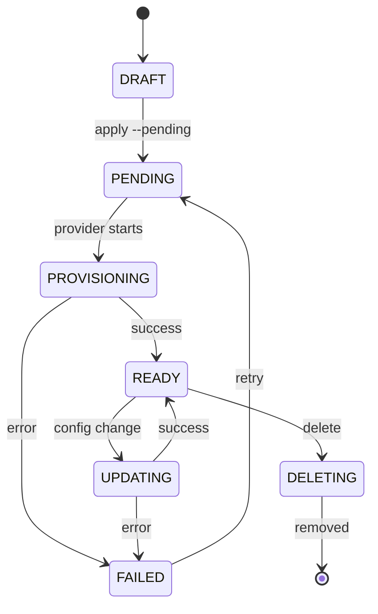

Resources are the infrastructure components that pragma-os manages: storage buckets, datasets, secrets, and more. You declare resources in YAML, and pragma-os handles provisioning, state tracking, and lifecycle management.

## Resource Structure

Every resource has a consistent structure:

| Field | Description | Example |
|-------|-------------|---------|
| `provider` | The provider that manages this resource | `gcp` |
| `resource` | The type of resource | `storage` |
| `name` | A unique identifier you assign | `data-lake` |
| `config` | Your settings for this resource | `location: EU` |
| `depends_on` | What it connects to | Other resources |
| `outputs` | What it exposes to other resources | URLs, IDs, secrets |

## Configuration Example

Here's a GCP storage bucket resource:

```yaml
provider: gcp
resource: storage
name: data-lake
config:
  location: EU
  storage_class: STANDARD
```

After provisioning, the resource exposes outputs that other resources can reference:

```yaml
# After provisioning, outputs become available:
# outputs:
#   bucket_url: "gs://pragma-data-lake-abc123"
#   self_link: "https://www.googleapis.com/storage/v1/b/pragma-data-lake-abc123"
```

## Resource Lifecycle

Resources move through these states as pragma manages them:



| State | Description |
|-------|-------------|
| **DRAFT** | Created but not yet queued |
| **PENDING** | Queued for provisioning |
| **PROVISIONING** | Currently being created |
| **READY** | Successfully provisioned and operational |
| **UPDATING** | Configuration change in progress |
| **DELETING** | Being removed |
| **FAILED** | Provisioning or update failed |

## Dependencies

Resources can depend on other resources. When you reference another resource's outputs, pragma automatically tracks the dependency:

```yaml
provider: gcp
resource: bigquery_dataset
name: analytics
config:
  location: EU

---
provider: gcp
resource: bigquery_table
name: events
config:
  dataset: ${gcp.bigquery_dataset.analytics.dataset_id}
  schema:
    - name: event_id
      type: STRING
    - name: timestamp
      type: TIMESTAMP
```

When the dataset changes, pragma knows to update the table.

## Applying Resources

Create resources in draft state:

```bash
pragma resources apply warehouse.yaml
```

Queue for immediate provisioning:

```bash
pragma resources apply --pending warehouse.yaml
```

## Next Steps

<CardGroup cols={2}>
  <Card title="Reactive Dependencies" icon="diagram-project" href="/concepts/reactive-dependencies">
    Automatic change propagation through dependencies.
  </Card>
  <Card title="CLI Resources" icon="terminal" href="/cli/resources">
    Resource management commands.
  </Card>
</CardGroup>
