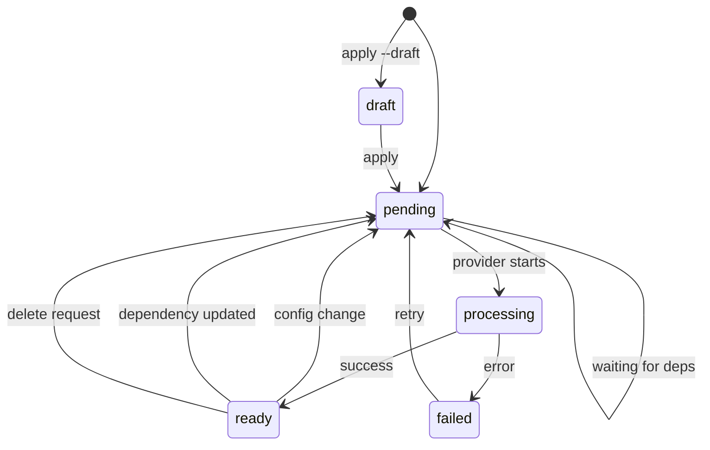

Resources are the infrastructure components that Pragmatiks manages: storage buckets, AI models, secrets, agents, and more. You declare resources in YAML, and Pragmatiks handles provisioning, state tracking, and lifecycle management.

## Resource Structure

Every resource has a consistent structure:

| Field | Description | Example |
|-------|-------------|---------|
| `provider` | The provider that manages this resource | `agno` |
| `resource` | The type of resource | `agent` |
| `name` | A unique identifier you assign | `my-assistant` |
| `config` | Your settings for this resource | `model_id: claude-sonnet-4-5-20250929` |
| `tags` | Optional metadata labels | `["env:prod", "team:ml"]` |
| `depends_on` | Explicit dependencies (optional) | Other resources |
| `owner_references` | Owner resources for cascade deletion (optional) | Parent resources |
| `outputs` | What it exposes to other resources (set by provider) | URLs, IDs, secrets |

## Configuration Example

Here's an Agno AI model resource:

```yaml
provider: agno
resource: anthropic-model
name: claude
config:
  model_id: claude-sonnet-4-5-20250929
  api_key:
    provider: pragma
    resource: secret
    name: anthropic-key
    field: outputs.api_key
tags:
  - env:production
  - team:ai
```

After provisioning, the resource exposes outputs that other resources can reference:

```yaml
# After provisioning, outputs become available:
# outputs:
#   model_name: "claude-sonnet-4-5-20250929"
#   provider_type: "anthropic"
```

## Resource Lifecycle

Resources move through these states as pragma manages them:


```mermaid
stateDiagram-v2
    [*] --> pending
    [*] --> draft: apply --draft
    draft --> pending: apply
    pending --> processing: provider starts
    pending --> pending: waiting for deps
    processing --> ready: success
    processing --> failed: error
    ready --> pending: config change
    ready --> pending: dependency updated
    failed --> pending: retry
    ready --> pending: delete request
```

| State | Description |
|-------|-------------|
| `draft` | Created but not queued for processing (use `--draft` flag) |
| `pending` | Queued for provider to handle. If dependencies aren't ready, the resource waits in this state until they are. |
| `processing` | Currently being handled by the provider |
| `ready` | Successfully provisioned and operational |
| `failed` | Processing failed, error recorded |

<Note>
A resource in `pending` state with unready dependencies has no `resolved_config` — this distinguishes "waiting for dependencies" from "submitted to provider." Once all dependencies are ready, Pragmatiks resolves the config and submits the resource for processing.
</Note>

## Config vs Resolved Config

Each resource has two config representations:

- **`config`** — Your original declaration, including FieldReferences and Dependency markers as-is
- **`resolved_config`** — The fully resolved version where all references have been replaced with actual values from dependency outputs

The `resolved_config` is what gets sent to the provider. You can inspect both to debug dependency resolution:

```bash
pragma resources describe agno/agent my-agent -o json
```

## Idempotent Apply

Re-applying a resource with identical configuration is a no-op. If the resource is already `ready` and the normalized config matches, Pragmatiks returns the existing resource without re-processing. This makes it safe to run `pragma resources apply` repeatedly in scripts and CI/CD pipelines.

## Deletion Behavior

When you delete a resource, Pragmatiks handles its relationships:

### Soft Detach (Dependencies)

Resources that **depend on** the deleted resource are **detached**, not cascade-deleted. The dependency reference is removed from their config, and they are sent back to their provider for update. The provider decides whether the resource can continue without the deleted dependency — if it can't, the resource transitions to `failed`.

```
# Before delete:
secret (READY) ← model (READY) ← agent (READY)

# After deleting secret:
model (PENDING → re-processed without secret) ← agent (waits for model)
```

### Cascade Delete (Owner References)

Resources with **owner references** follow cascade deletion. When the owner is deleted, all owned resources are deleted too. This is used for subresource patterns where child resources have no meaning without their parent.

```yaml
# Team owns its agents — deleting the team deletes the agents
provider: agno
resource: agent
name: team-member
config:
  instructions: "..."
owner_references:
  - provider: agno
    resource: team
    name: my-team
```

If a resource has multiple owners, it's only deleted when the last owner is removed.

## Resource Tags

Tags are key-value labels for organizing and filtering resources:

```yaml
provider: agno
resource: agent
name: my-agent
config:
  instructions: "..."
tags:
  - env:production
  - team:ai
  - cost-center:123
```

Filter resources by tag:

```bash
pragma resources list --tag env:production
```

Manage tags on existing resources:

```bash
pragma resources tags add agno/agent my-agent --tag env:staging
pragma resources tags remove agno/agent my-agent --tag env:production
```

## Applying Resources

Create and provision resources immediately:

```bash
pragma resources apply warehouse.yaml
```

Create resources in draft state (skip provisioning):

```bash
pragma resources apply --draft warehouse.yaml
```

## Next Steps

<CardGroup cols={2}>
  <Card title="Reactive Dependencies" icon="diagram-project" href="/concepts/reactive-dependencies">
    Automatic change propagation through dependencies.
  </Card>
  <Card title="CLI Resources" icon="terminal" href="/cli/resources">
    Resource management commands.
  </Card>
</CardGroup>
