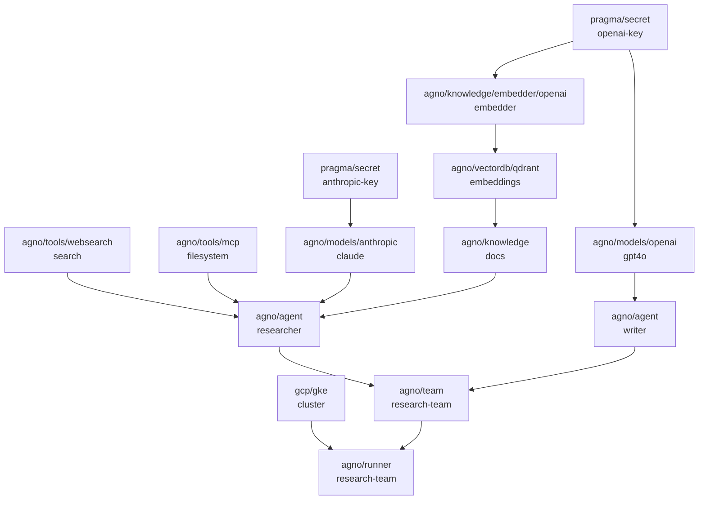

In this quickstart, you'll build a multi-agent research team with web search, an MCP tool server, a knowledge base backed by vector search, and persistent storage. You'll see how Pragmatiks resolves complex dependency graphs and automatically propagates changes.

<Note>
**Time estimate**: 45 minutes. Assumes you've completed the [amateur quickstart](/quickstart/amateur).
</Note>

## What you'll build



13 resources, wired together. Pragmatiks resolves the entire dependency graph in the correct order.

## Prerequisites

- Completed the [amateur quickstart](/quickstart/amateur) (CLI installed, authenticated)
- An [OpenAI API key](https://platform.openai.com/api-keys) (for embeddings and GPT-4o)
- A running Qdrant instance ([Qdrant Cloud](https://cloud.qdrant.io/) free tier works)
- A GKE cluster managed by Pragmatiks (created in the amateur quickstart)

## Step 1: Secrets

Store all API keys as pragma secrets. Create `secrets.yaml`:

```yaml secrets.yaml
provider: pragma
resource: secret
name: anthropic-key
config:
  data:
    ANTHROPIC_API_KEY: "sk-ant-your-key-here"
---
provider: pragma
resource: secret
name: openai-key
config:
  data:
    OPENAI_API_KEY: "sk-your-openai-key-here"
---
provider: pragma
resource: secret
name: qdrant-key
config:
  data:
    QDRANT_API_KEY: "your-qdrant-api-key"
```

```bash
pragma resources apply secrets.yaml
```

## Step 2: AI models

Configure two models from different providers. Create `models.yaml`:

```yaml models.yaml
provider: agno
resource: models/anthropic
name: claude
config:
  id: claude-sonnet-4-5-20250929
  api_key:
    provider: pragma
    resource: secret
    name: anthropic-key
    field: outputs.ANTHROPIC_API_KEY
---
provider: agno
resource: models/openai
name: gpt4o
config:
  id: gpt-4o
  api_key:
    provider: pragma
    resource: secret
    name: openai-key
    field: outputs.OPENAI_API_KEY
```

Each model's `api_key` is a **field reference** pointing to a secret output. The key value is injected automatically at provisioning time.

```bash
pragma resources apply models.yaml
```

## Step 3: Tools

Give agents capabilities through tools. Create `tools.yaml`:

```yaml tools.yaml
provider: agno
resource: tools/websearch
name: search
config:
  enable_search: true
  enable_news: true
  backend: auto
---
provider: agno
resource: tools/mcp
name: filesystem
config:
  command: "npx -y @modelcontextprotocol/server-filesystem /data"
```

The web search tool gives agents internet access. The MCP tool connects to a Model Context Protocol server — in this case, a filesystem server for reading local files.

```bash
pragma resources apply tools.yaml
```

## Step 4: Knowledge base

Set up vector search so agents can query a knowledge base. This creates three connected resources: an embedder, a vector database, and the knowledge base itself.

Create `knowledge.yaml`:

```yaml knowledge.yaml
provider: agno
resource: knowledge/embedder/openai
name: embedder
config:
  id: text-embedding-3-small
  api_key:
    provider: pragma
    resource: secret
    name: openai-key
    field: outputs.OPENAI_API_KEY
---
provider: agno
resource: vectordb/qdrant
name: embeddings
config:
  url: "https://your-instance.cloud.qdrant.io:6333"
  collection: knowledge-base
  api_key:
    provider: pragma
    resource: secret
    name: qdrant-key
    field: outputs.QDRANT_API_KEY
  search_type: hybrid
  embedder:
    provider: agno
    resource: knowledge/embedder/openai
    name: embedder
---
provider: agno
resource: knowledge
name: docs
config:
  vector_db:
    provider: agno
    resource: vectordb/qdrant
    name: embeddings
  max_results: 5
```

Notice the layered dependencies:
- The **embedder** references the OpenAI secret
- The **vector database** references the embedder (dependency) and the Qdrant secret (field reference)
- The **knowledge base** references the vector database

```bash
pragma resources apply knowledge.yaml
```

## Step 5: Agents

Define two specialized agents with different models and capabilities. Create `agents.yaml`:

```yaml agents.yaml
provider: agno
resource: agent
name: researcher
config:
  description: "Research specialist with web search and knowledge base access"
  model:
    provider: agno
    resource: models/anthropic
    name: claude
  instructions:
    - "You are a research specialist."
    - "Search the web for current information."
    - "Check the knowledge base for internal documents."
    - "Cite your sources."
  tools:
    - provider: agno
      resource: tools/websearch
      name: search
    - provider: agno
      resource: tools/mcp
      name: filesystem
  knowledge:
    provider: agno
    resource: knowledge
    name: docs
  markdown: true
---
provider: agno
resource: agent
name: writer
config:
  description: "Technical writer that produces clear documentation"
  model:
    provider: agno
    resource: models/openai
    name: gpt4o
  instructions:
    - "You are a technical writer."
    - "Take research findings and produce clear, structured documentation."
    - "Use headings, bullet points, and code examples."
  markdown: true
```

The **researcher** agent uses Claude with web search, MCP tools, and knowledge base access. The **writer** agent uses GPT-4o with a focused writing prompt. Each agent declares its model as a dependency, so model changes propagate automatically.

```bash
pragma resources apply agents.yaml
```

## Step 6: Team

Combine agents into a team. Create `team.yaml`:

```yaml team.yaml
provider: agno
resource: team
name: research-team
config:
  description: "Research team that finds information and produces documentation"
  members:
    - provider: agno
      resource: agent
      name: researcher
    - provider: agno
      resource: agent
      name: writer
  instructions:
    - "Coordinate research and writing tasks."
    - "The researcher finds information, the writer produces the final output."
  markdown: true
```

The team references both agents as dependencies in its `members` list. When either agent changes, the team rebuilds.

```bash
pragma resources apply team.yaml
```

## Step 7: Deploy and observe

Deploy the team to your GKE cluster. Create `runner.yaml`:

```yaml runner.yaml
provider: agno
resource: runner
name: research-team
config:
  team:
    provider: agno
    resource: team
    name: research-team
  cluster:
    provider: gcp
    resource: gke
    name: my-cluster
  namespace: agents
```

```bash
pragma resources apply runner.yaml
```

Watch the resources resolve:

```bash
pragma resources list
```

All 13 resources should reach `READY` state. Pragmatiks resolved the dependency graph — secrets first, then models and tools, then agents, then the team, then the runner.

## Step 8: Change propagation

This is where reactive dependencies shine. Swap the researcher's model from Claude to GPT-4o and watch the cascade.

Update `agents.yaml` — change the researcher's model reference:

```yaml
provider: agno
resource: agent
name: researcher
config:
  description: "Research specialist with web search and knowledge base access"
  model:
    provider: agno
    resource: models/openai
    name: gpt4o
  instructions:
    - "You are a research specialist."
    - "Search the web for current information."
    - "Check the knowledge base for internal documents."
    - "Cite your sources."
  tools:
    - provider: agno
      resource: tools/websearch
      name: search
    - provider: agno
      resource: tools/mcp
      name: filesystem
  knowledge:
    provider: agno
    resource: knowledge
    name: docs
  markdown: true
```

```bash
pragma resources apply agents.yaml
```

Now watch what happens:

```bash
pragma resources list
```

1. The **researcher** agent rebuilds with the new model
2. The **research-team** automatically rebuilds because its member changed
3. The **runner** redeploys because the team spec changed

You changed one line, and Pragmatiks propagated the change through three resources. No manual coordination needed.

## How it works

Two mechanisms make this possible:

**Dependencies** (`Dependency[T]`) link resources together. When a resource declares a dependency on another, Pragmatiks tracks the relationship. If the upstream resource changes, the dependent rebuilds.

```yaml
# This declares: "my agent depends on the claude model"
model:
  provider: agno
  resource: models/anthropic
  name: claude
```

**Field references** (`Field[T]`) inject specific output values from other resources. The referenced value is resolved at provisioning time and re-resolved when the source changes.

```yaml
# This declares: "inject the ANTHROPIC_API_KEY output from the secret"
api_key:
  provider: pragma
  resource: secret
  name: anthropic-key
  field: outputs.ANTHROPIC_API_KEY
```

Resources can be applied in any order. Pragmatiks holds unresolved resources in `PENDING` state until their dependencies are ready, then processes them automatically.

## Full YAML

<Accordion title="Complete multi-document YAML (all 13 resources)">
```yaml pipeline.yaml
# --- Secrets ---
provider: pragma
resource: secret
name: anthropic-key
config:
  data:
    ANTHROPIC_API_KEY: "sk-ant-your-key-here"
---
provider: pragma
resource: secret
name: openai-key
config:
  data:
    OPENAI_API_KEY: "sk-your-openai-key-here"
---
provider: pragma
resource: secret
name: qdrant-key
config:
  data:
    QDRANT_API_KEY: "your-qdrant-api-key"
---
# --- Models ---
provider: agno
resource: models/anthropic
name: claude
config:
  id: claude-sonnet-4-5-20250929
  api_key:
    provider: pragma
    resource: secret
    name: anthropic-key
    field: outputs.ANTHROPIC_API_KEY
---
provider: agno
resource: models/openai
name: gpt4o
config:
  id: gpt-4o
  api_key:
    provider: pragma
    resource: secret
    name: openai-key
    field: outputs.OPENAI_API_KEY
---
# --- Tools ---
provider: agno
resource: tools/websearch
name: search
config:
  enable_search: true
  enable_news: true
  backend: auto
---
provider: agno
resource: tools/mcp
name: filesystem
config:
  command: "npx -y @modelcontextprotocol/server-filesystem /data"
---
# --- Knowledge ---
provider: agno
resource: knowledge/embedder/openai
name: embedder
config:
  id: text-embedding-3-small
  api_key:
    provider: pragma
    resource: secret
    name: openai-key
    field: outputs.OPENAI_API_KEY
---
provider: agno
resource: vectordb/qdrant
name: embeddings
config:
  url: "https://your-instance.cloud.qdrant.io:6333"
  collection: knowledge-base
  api_key:
    provider: pragma
    resource: secret
    name: qdrant-key
    field: outputs.QDRANT_API_KEY
  search_type: hybrid
  embedder:
    provider: agno
    resource: knowledge/embedder/openai
    name: embedder
---
provider: agno
resource: knowledge
name: docs
config:
  vector_db:
    provider: agno
    resource: vectordb/qdrant
    name: embeddings
  max_results: 5
---
# --- Agents ---
provider: agno
resource: agent
name: researcher
config:
  description: "Research specialist with web search and knowledge base access"
  model:
    provider: agno
    resource: models/anthropic
    name: claude
  instructions:
    - "You are a research specialist."
    - "Search the web for current information."
    - "Check the knowledge base for internal documents."
    - "Cite your sources."
  tools:
    - provider: agno
      resource: tools/websearch
      name: search
    - provider: agno
      resource: tools/mcp
      name: filesystem
  knowledge:
    provider: agno
    resource: knowledge
    name: docs
  markdown: true
---
provider: agno
resource: agent
name: writer
config:
  description: "Technical writer that produces clear documentation"
  model:
    provider: agno
    resource: models/openai
    name: gpt4o
  instructions:
    - "You are a technical writer."
    - "Take research findings and produce clear, structured documentation."
    - "Use headings, bullet points, and code examples."
  markdown: true
---
# --- Team ---
provider: agno
resource: team
name: research-team
config:
  description: "Research team that finds information and produces documentation"
  members:
    - provider: agno
      resource: agent
      name: researcher
    - provider: agno
      resource: agent
      name: writer
  instructions:
    - "Coordinate research and writing tasks."
    - "The researcher finds information, the writer produces the final output."
  markdown: true
---
# --- Deployment ---
provider: agno
resource: runner
name: research-team
config:
  team:
    provider: agno
    resource: team
    name: research-team
  cluster:
    provider: gcp
    resource: gke
    name: my-cluster
  namespace: agents
```
</Accordion>

```bash
pragma resources apply pipeline.yaml
```

## Next steps

<CardGroup cols={2}>
  <Card title="Create a Custom Provider" icon="plug" href="/quickstart/expert">
    Build your own provider to manage custom resource types.
  </Card>
  <Card title="Reactive Dependencies" icon="rotate" href="/concepts/reactive-dependencies">
    Deep dive into the dependency resolution system.
  </Card>
</CardGroup>
